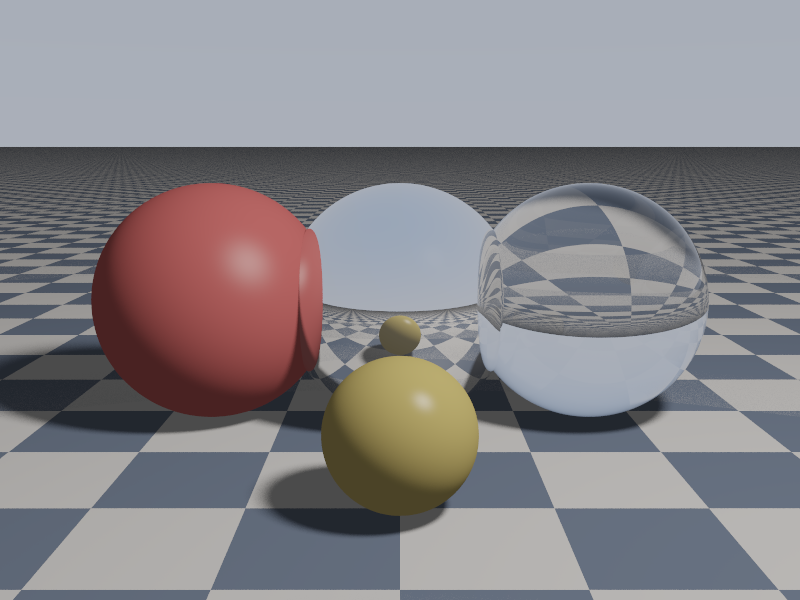
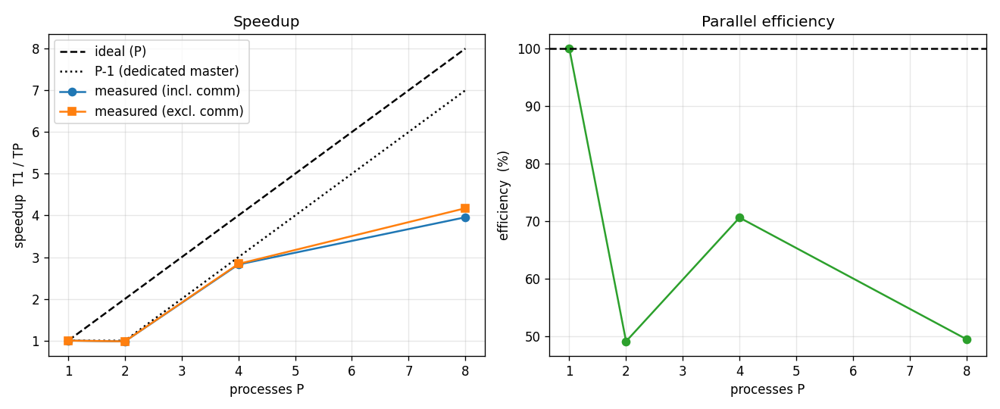
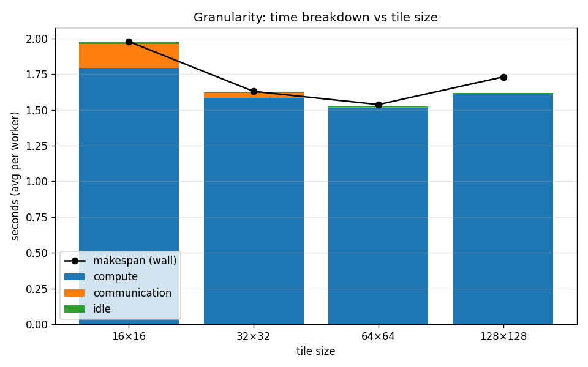
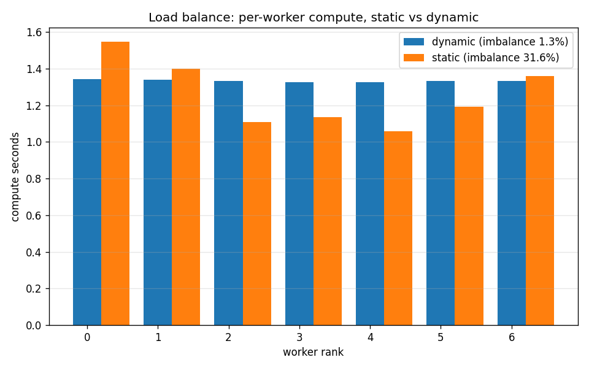
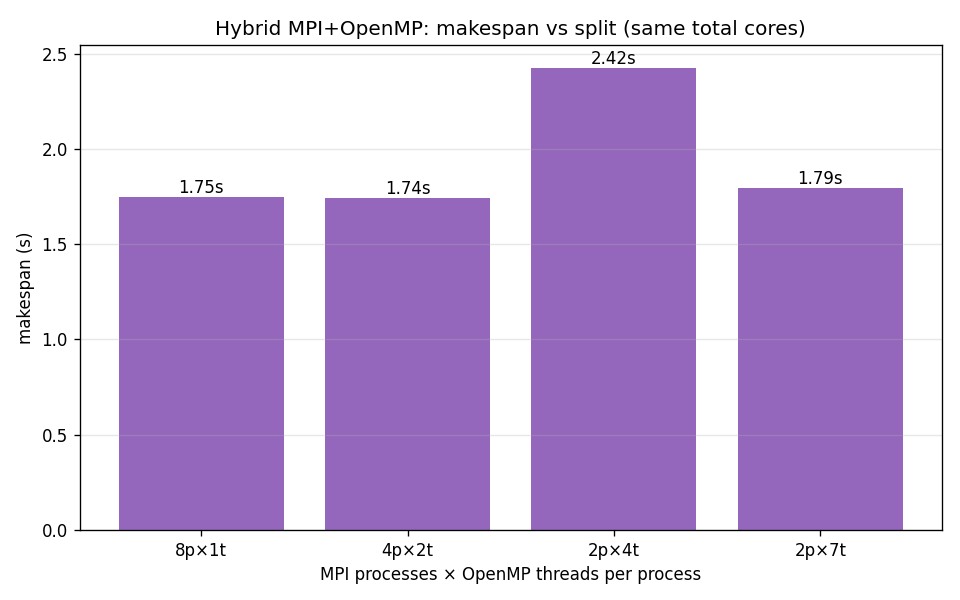

# MPI-Based Distributed Ray Tracing Renderer

**IT4130E — Parallel and Distributed Programming · 4-member project**

This project implements a distributed ray tracing renderer in **C++17 + MPI
(+ OpenMP)**. It renders an animated 3D scene — hard & soft shadows, reflections,
refraction (glass), spheres/planes/triangles/**boxes**, a spotlight, anti-aliasing,
**path-traced global illumination**, an orbiting camera and a moving light — as a
sequence of image frames, distributes
the per-frame tile workload across an MPI cluster with a **dynamic master-worker
scheduler**, assembles the frames into a video, and measures correctness,
runtime, communication overhead, granularity, speedup and parallel efficiency.

The parallelism is **two-level**: MPI distributes tiles across processes and
OpenMP threads each worker across its cores, with an optional **non-blocking
prefetch** path that overlaps communication with computation.

It is positioned as a **distributed rendering *system***, not a graphics demo:
the priority is a working MPI pipeline with measurable, explainable parallel
performance and a provable correctness guarantee against a sequential baseline.

> **New to ray tracing or MPI?** Start with **[Appendix A — Background: the math
> & concepts](#appendix-a--background-the-math--concepts-you-need)** at the bottom
> of this file. It explains every equation and parallel-computing term used here
> from scratch. Each member's journal in `docs/members/` also opens with the
> theory for that member's part.



*Demo scene: checker floor, a diffuse sphere, a mirror sphere, a refractive glass
sphere, a glossy gold sphere, and a triangle pyramid, under a soft area light
plus a cyan spotlight. Minecraft-themed scenes use axis-aligned boxes for blocks.*

---

## 1. Why ray tracing, and why parallelize it?

Each output pixel is computed by shooting a ray from the camera into the scene
and recursively tracing what it hits (shadows, reflections, refraction). Pixels
are **independent** — no pixel needs the result of another — so the image is
*embarrassingly parallel*. But it is also **expensive**: cost grows as

```
N = Frames × Width × Height × SamplesPerPixel × RayDepth × ShadowSamples
```

This combination — expensive and independent — is exactly what distributed
computing is for. We split each frame into rectangular **tiles** and let many
machines render tiles at once.

## 2. Results at a glance

Measured on one 8-core machine (`mpirun -np P`, 1 master + P−1 workers),
480×360, spp 16, reflection depth 8, soft shadows ×4, best-of-3 trials:

| Metric | Result |
|---|---|
| **Correctness** | Sequential vs MPI frames are **byte-identical (MSE = 0)** — every mode (dynamic/static, hybrid, prefetch) and any P |
| **Speedup (flat MPI)** | 2.8× at P=4, **4.0× at P=8** (dedicated master ⇒ ceiling is the P−1 workers) |
| **Hybrid MPI+OpenMP** | 1 worker scales **4.86×** over 1→7 threads; 4 procs×2 threads ≈ flat 8 procs×1 |
| **Load balance** | dynamic **3 %** worker imbalance vs static **27 %** (static run ~19 % slower) |
| **Granularity** | communication share falls **8.6 % → 0.2 %** as tiles grow 16→128 |
| **Prefetch** | non-blocking double-buffer; MSE = 0, small single-node gain (latency-bound benefit grows on a network) |
| **Rendering** | Path-traced **global illumination** (indirect diffuse bounce + Russian Roulette), **ACES filmic** tone mapping, rough reflections, **depth of field** |
| **Output** | 480×360 H.264 video, orbiting camera + moving soft shadows |

## 3. Architecture

The renderer core is **MPI-agnostic**; MPI lives in its own module and is only
compiled into the distributed build. One codebase, two binaries:

```
make seq  -> raytracer_seq   (clang++,           correctness baseline)
make mpi  -> raytracer_mpi   (mpic++ -DUSE_MPI,  adds master-worker layer)
```

```
                         ┌──────────────────────────────────────────┐
                         │                  main.cpp                 │
                         │   CLI · seq frame-loop  /  MPI rank split │
                         └───────────────┬───────────────┬──────────┘
                                         │               │
                        ┌────────────────▼───┐      ┌────▼─────────────────┐
                        │  Renderer (D)      │      │  MPI layer (C)        │
                        │  render_tile():    │      │  master / worker /    │
                        │  AA + tonemap+gamma│◄─────│  serializer / tags    │
                        └───────┬─────┬──────┘ calls└───────────────────────┘
                                │     │
                 ┌──────────────▼─┐ ┌─▼───────────────────┐
                 │ Camera+geometry│ │ shade()  (B)        │
                 │ (A)            │ │ Phong · shadows ·   │
                 │ Vec3/Ray/RNG/  │ │ reflection ·        │
                 │ Sphere/Plane   │ │ refraction · gamma  │
                 └────────────────┘ └─────────┬───────────┘
                                              │ queries
                                    ┌─────────▼──────────┐
                                    │ Scene : ISceneQuery │ (D)
                                    │ objects/materials/  │
                                    │ lights/camera/bg    │
                                    └─────────────────────┘
```

**Key seam:** the shader (B) is written against an abstract `ISceneQuery`, not
the concrete `Scene` (D). The *same* `shade()` runs in the sequential renderer
and inside every MPI worker, and each subsystem can be compiled and unit-tested
on its own.

### Data flow for one tile
```
Renderer.render_tile(tile)
  for each pixel, for each sample s:
      rng = RNG( seed_for(frame, x, y, s) )          # A — deterministic
      ray = Camera.get_ray(u + jitter, v + jitter)   # A
      color += shade(scene, ray, depth=0, ...)        # B (path-traces: direct + indirect GI + mirror)
  pixel = gamma( ACES_tonemap( color / spp ) )       # B helpers, D applies
```

## 4. Parallel model (the report's core questions)

**What is parallelized?** The pixels of every frame, grouped into 2-D tiles.

**Why is it parallelizable?** Pixels are independent; a tile needs only the
(read-only) scene, never a neighbour tile's result.

**Decomposition — hybrid (data + task).** Data: each frame is split into
`tile_size × tile_size` pixel blocks. Task: each tile is an independent unit of
work `(frame, x0,y0,x1,y1)`.

**Mapping — dynamic master-worker.**
```
Rank 0  = master : generates tasks, hands them out, assembles & writes frames
Rank 1..P-1 = workers : receive a tile, render it, return the pixels, repeat
```

**Communication — star topology, blocking MPI.**
```
            worker 1
               │
 worker 4 ── master(0) ── worker 2          MPI_Bcast : config to all
               │                            MPI_Send/Recv + ANY_SOURCE : tiles
            worker 3                         MPI_Gather : timing stats
```
A worker's result message *is* its request for more work (self-scheduling), so
there is no separate request message. The master tracks a per-rank FIFO of
in-flight tiles (`inflight[rank]`), so a result is just raw RGB bytes — no header.

**Load balancing.** Tiles vary in cost (a tile over the glass sphere triggers
deep reflection/refraction recursion; a background tile is cheap). With
**dynamic** scheduling a worker that finishes early immediately pulls the next
tile, so fast workers naturally do more. The **static** baseline binds tile *i*
to worker `i mod (P−1)` up front and cannot adapt — which is why it imbalances
(see §6).

**Second level — OpenMP (hybrid).** Each worker additionally threads the rows of
its tile with `#pragma omp parallel for` (`--threads N`), so the system uses both
distributed-memory (MPI, across processes/nodes) and shared-memory (OpenMP,
across a node's cores) parallelism — the canonical HPC pattern for a cluster of
multi-core machines.

**Latency hiding — non-blocking prefetch (`--prefetch`).** The master runs
*depth-2* dispatch and the worker double-buffers with `MPI_Irecv`/`MPI_Isend`, so
the next tile arrives and the previous result ships *while the current tile
renders*. Communication overlaps computation instead of stalling it.

## 5. Correctness — identical to the sequential renderer

The renderer is a **pure function of (scene, parameters)**:

- The scene is rebuilt from the frame index by `build_demo_scene(aspect, frame,
  total)` — no shared mutable animation state.
- Every random sample is seeded by `seed_for(frame, x, y, sample)` — by *where
  and when* the sample is, never by *which process* draws it.

So a pixel computes the same value regardless of which rank, which tile, or which
schedule renders it. Validated with `tools/compare_frames.py`: sequential vs
`-np 4/6/8`, dynamic and static, hard and soft shadows — **MSE = 0, max pixel
difference = 0 (byte-identical)**, not merely "close".

## 6. Experiments

Run them yourself: `make mpi && tools/run_experiments.sh && python3 tools/make_charts.py output`

### 6.1 Speedup & efficiency


T1 = 8.33 s. P=4 → 2.95 s (**2.8×**), P=8 → 2.11 s (**4.0×**). The measured curve
hugs the *P−1* line because rank 0 is a dedicated coordinator — with one worker
(P=2) there is no speedup, and efficiency is best measured against the P−1 actual
compute processes. The "excl. comm" curve sits just above "incl. comm", confirming
communication is a small fraction of runtime. (The flat-MPI ceiling of P−1 is
exactly what the hybrid in §6.4 lifts.)

### 6.2 Granularity


Fixed N and P=8, tile size 16→128. Compute per worker is roughly constant; the
**communication share shrinks from 8.6 % (16×16) to 0.2 % (64×64)** because
coarser tiles mean fewer, larger messages through the single master. The classic
trade-off: fine tiles balance better but cost more scheduling traffic.

### 6.3 Load balance — dynamic vs static


P=8, tile 64. **Dynamic keeps every worker within 3 %** of the others; **static
spreads them by 27 %** (one worker draws several heavy glass/mirror tiles while
others idle), making the static run ~19 % slower overall. This is the headline
argument for dynamic scheduling.

### 6.4 Hybrid MPI + OpenMP


Same workload and total cores, different process×thread split. Flat MPI
(8 procs × 1 thread, 1.75 s) and the hybrid (4 procs × 2 threads, 1.74 s) are
equivalent, and a *single* worker with 7 OpenMP threads (2 procs × 7 threads,
1.79 s) nearly matches 7 MPI workers — confirming the OpenMP layer parallelizes
correctly. (2 procs × 4 threads is slower only because it uses 4 cores, not 7.)
On its own, one worker scales 8.48 s → 1.74 s over 1→7 threads (**4.86×**).

### 6.5 Non-blocking prefetch
`--prefetch` overlaps the next-tile `Irecv` and previous-result `Isend` with the
current render. It is byte-identical to blocking (MSE = 0) and slightly faster on
one node (0.79 → 0.78 s; 0.625 → 0.617 s at fine tiles). The gain is small here
because shared-memory MPI latency is tiny — that communication is *not* the
bottleneck is itself a finding; the technique pays off as network latency grows.

## 7. Team & contributions

Each member owns a subsystem with a small, well-defined interface and a dev
journal (`docs/members/`) recording *idea → what I did → why-not-the-alternative*
for every step. LOC below = non-blank lines of **main renderer/MPI code** in owned
files (each member clears the ≥ 250 bar on this measure alone). Member D
additionally owns a ~435-line report/tooling layer (benchmark + scripts), counted
separately so it doesn't inflate the comparison.

| Member | Subsystem | Owns (main code) | Main LOC | Journal |
|---|---|---|---|---|
| **A** | Rendering core & math | `core/{vec3,ray,color,random}`, `scene/{object,camera,sphere,plane,triangle}` | **273** | [A](members/member-a-rendering-core.md) |
| **B** | Lighting, materials, shading | `scene/{material,light}`, `render/shading` | **251** | [B](members/member-b-lighting-materials.md) |
| **C** | MPI + OpenMP scheduling & comms | `mpi/{tags,serializer,master,worker}` | **322** | [C](members/member-c-mpi-scheduling.md) |
| **D** | Scene, renderer, animation, integration | `scene/scene`, `render/{renderer,image,tile}`, `core/timer`, `main.cpp` | **357** | [D](members/member-d-integration-benchmark.md) |

Member D also owns the report/tooling layer (~435 LOC, not counted above):
`benchmark/{benchmark,csv_logger}` + `tools/{run_experiments.sh, make_charts.py,
compare_frames.py, assemble_video.sh}`.

- **A** provides the geometry/numeric foundation (vec/ray/RNG, camera,
  sphere/plane/triangle), including the pixel-seeded deterministic RNG the whole
  correctness story rests on.
- **B** turns a ray-hit into a color: Phong diffuse+specular, hard & soft shadows,
  recursive reflection with Fresnel, refractive glass (Beer-Lambert), spotlight,
  gamma — all behind the `ISceneQuery` interface, never depending on the scene.
- **C** distributes the work: dynamic master-worker over `MPI_ANY_SOURCE`, a static
  baseline, the wire format, per-rank comp/comm/idle timing, **and the two
  advanced parallel modes — the MPI+OpenMP hybrid and the non-blocking prefetch**.
- **D** ties it together (scene, renderer glue, PPM I/O, animation, CLI) and owns
  measurement & delivery (timing, CSV, correctness tool, charts, video).

## 8. Build & run

```bash
# unit tests (Members A & B)
make test                 # 42 checks

# sequential baseline
make seq
./raytracer_seq --width 480 --height 360 --spp 16 --depth 8 --shadow-samples 6 --frames 48

# distributed render (flat MPI)
make mpi
mpirun -np 8 ./raytracer_mpi --width 480 --height 360 --spp 16 --depth 8 \
       --shadow-samples 6 --frames 48 --tile 32 --schedule dynamic

# hybrid MPI+OpenMP (note: --bind-to none so OpenMP can use multiple cores)
mpirun --bind-to none -np 4 ./raytracer_mpi --threads 2 --frames 48

# non-blocking prefetch
mpirun -np 8 ./raytracer_mpi --prefetch --frames 48

# video, experiments, charts, correctness
tools/assemble_video.sh frames output/render.mp4 24
tools/run_experiments.sh
python3 tools/make_charts.py output
python3 tools/compare_frames.py frames_seq frames_mpi
```

CLI flags: `--width --height --spp --depth --shadow-samples --frames --tile
--schedule {dynamic|static} --threads <n> --prefetch --out <dir> --bench <csv>`.

**Multi-machine note:** on a real cluster, add a hostfile —
`mpirun --hostfile hosts -np 12 ./raytracer_mpi ...`. The code is unchanged; only
the launch differs. (For grading, `-np` on one node simulates the cluster.)

## 9. Repository layout

```
src/
  core/      vec3 ray color random timer            (A, +D timer)
  scene/     object camera sphere plane triangle box (A)  # box = AABB slab method
             material light                          (B)
             scene scene_parser json_parser           (D)  # JSON scene loading
  render/    shading                                 (B)  # path-traced GI + ACES tonemap
             renderer image tile                     (D)  # render_tile has the OpenMP pragma
  mpi/       tags serializer master worker           (C)  # hybrid + prefetch live here
  benchmark/ benchmark csv_logger                    (D)
  main.cpp   test_core.cpp
tools/       assemble_video.sh run_experiments.sh make_charts.py compare_frames.py
docs/        PROJECT.md  members/*.md  results/*  superpowers/{specs,plans}/*
```

## 10. Scope, limitations, future work

**Done:** distributed tile rendering; dynamic + static scheduling; **MPI+OpenMP
hybrid**; **non-blocking prefetch**; sphere/plane/triangle/**box (AABB)** geometry;
hard & soft shadows; reflection; refraction; spotlight; anti-aliasing; animation;
video; byte-exact correctness; full benchmark suite (speedup, granularity, load
balance, hybrid); **path-traced global illumination** (cosine-weighted importance
sampling + Russian Roulette); **ACES filmic tone mapping**; **rough reflections**
for glossy materials; **depth of field** (thin-lens camera); **JSON scene configs**
(30 scenes including 22 Minecraft-themed with box blocks + cathedral, hall of
mirrors, frozen throne).

**Known limitations (honest):**
- Rank 0 is a dedicated coordinator, so flat-MPI speedup is capped at P−1 cores.
  The hybrid (§6.4) sidesteps this by giving the few workers many threads; a
  master that also renders when idle would recover the core for flat mode too.
- A single master serializes all scheduling traffic; at very fine tiles this is
  the bottleneck (visible in §6.2). The prefetch path (§6.5) hides the per-tile
  round-trip but not the master's aggregate throughput.
- Tested on one 8-core node (`-np` simulates the cluster). The code is
  cluster-ready (`mpirun --hostfile`), but multi-node numbers aren't measured
  here — the prefetch benefit in particular would be larger across a network.
- No spatial acceleration structure (BVH): every ray tests every object. Fine for
  this scene; would matter for large ones.

**Deferred (per proposal §13):** BVH, textures, triangle *meshes* (the triangle
primitive exists; mesh loading does not). Non-blocking MPI and the hybrid, listed
as optional sophistication, are **implemented**. Path-traced GI, ACES tone mapping,
box primitive, depth of field, and JSON scene configs were added post-proposal to
bring rendering quality closer to GPU ray tracing standards.

---

# Appendix A — Background: the math & concepts you need

New to ray tracing or MPI? Read this once and the rest of the project (and the
viva questions) will make sense. Two halves: **the graphics math** (how a pixel
becomes a colour) and **the parallel-computing concepts** (how we make it fast).
Vectors are written `a`, dot product `a·b`, cross product `a×b`, `|a|` is length.

## A.1 The graphics math

### The ray
A ray is a half-line: a point `P` along it is
```
P(t) = O + t·D ,    t ≥ 0
```
`O` = origin (the camera, or a hit point), `D` = direction (we keep it unit
length). Ray tracing = "for each pixel, find the first surface the ray hits and
work out its colour."

### Ray–sphere intersection (a quadratic)
A sphere is all points at distance `r` from centre `C`: `|X − C|² = r²`. Put the
ray into it (`X = O + tD`, let `oc = O − C`):
```
(D·D) t² + 2(oc·D) t + (oc·oc − r²) = 0
```
That's `a t² + b t + c = 0`. The **discriminant** `Δ = b² − 4ac` tells us:
`Δ < 0` → miss; `Δ ≥ 0` → hit at `t = (−b ∓ √Δ)/(2a)` (take the smaller positive
`t` — the nearest surface). Code uses the tidy "half-b" form (`b/2 = oc·D`).

### Ray–plane intersection (one division)
Plane = point `Q` + normal `N`: `(X − Q)·N = 0`. Solve:
```
t = ((Q − O)·N) / (D·N)
```
If `D·N ≈ 0` the ray is parallel to the plane (no hit).

### Ray–triangle (Möller–Trumbore, barycentric)
Any point in a triangle is `(1−u−v)·V0 + u·V1 + v·V2` with `u,v ≥ 0`,
`u+v ≤ 1` (the **barycentric** weights). Setting that equal to `O + tD` and
solving the 3×3 system (with edges `e1=V1−V0`, `e2=V2−V0`) gives `t, u, v`
directly — the inside test is just the sign of `u, v, u+v`.

### Surface normal
The **normal** `N` is the unit vector perpendicular to the surface at the hit
point — it drives all the lighting. Sphere: `N = (P − C)/r`. Plane: `N` is given.
Triangle: `N = normalize(e1 × e2)`.

### Local lighting — the Phong model
Colour at a hit = ambient + a sum over lights of diffuse + specular:
```
ambient  = ka · albedo                       (a little base light so shadows aren't pure black)
diffuse  = albedo · I_light · max(0, N·L)    (Lambert: brightest when the surface faces the light)
specular = ks · I_light · max(0, R·V)^shininess   (Phong highlight)
```
`L` = unit direction to the light, `V` = unit direction to the camera, `R` =
`L` reflected about `N`. `N·L` is a cosine — it falls off as the surface turns
away from the light. The `^shininess` power makes the specular dot tight/shiny.

### Shadows
Before adding a light's contribution, shoot a **shadow ray** from the hit point
toward the light. If it hits anything *before* reaching the light, that point is
in shadow for that light (skip it).

**Soft shadows** = a light with area, not a point. Sample `S` random points on the
light and average the visibility; partial blocking gives a smooth **penumbra**.
This is **Monte Carlo integration**: `E[f] ≈ (1/S) Σ f(xᵢ)` — more samples, less
noise.

### Reflection (mirrors)
A mirror ray is the incoming direction bounced about the normal:
```
R = D − 2 (D·N) N
```
We trace it recursively and mix the result in; a recursion **depth** cap stops
infinite bouncing between mirrors.

### Refraction (glass) — Snell + Fresnel
Light bends entering a denser medium. **Snell's law:** `n₁ sin θ₁ = n₂ sin θ₂`
(`n` = index of refraction; air ≈ 1, glass ≈ 1.5). Vector form with `η = n₁/n₂`,
`c = −D·N`:
```
T = η D + (η c − √(1 − η²(1 − c²))) N
```
If the square root's argument is negative there is **total internal reflection**
(no exit ray — all light reflects). How much reflects vs refracts is the
**Fresnel** term, approximated by **Schlick**:
```
R(θ) = R0 + (1 − R0)(1 − cos θ)⁵ ,   R0 = ((n₁ − n₂)/(n₁ + n₂))²
```
(more reflection at grazing angles — why glass rims look bright).

**Beer–Lambert** absorption tints thick glass: light surviving a path of length
`d` is `I = I₀ · e^(−σ d)` per colour channel (`σ` = absorption).

### Finishing a pixel
- **Anti-aliasing (supersampling):** shoot `spp` rays through jittered sub-pixel
  positions and average — `colour = (1/spp) Σ shade(rayᵢ)` — to smooth jagged
  edges.
- **Tone mapping (Reinhard):** squash unbounded brightness into `[0,1)` with
  `c' = c/(1+c)` so highlights don't clip to flat white.
- **Gamma correction:** monitors are non-linear, so we encode `c^(1/2.2)` at the
  very end (rendering math stays *linear* until then).

## A.2 The parallel-computing concepts

### Why ray tracing parallelizes perfectly
Every pixel is computed **independently** — no pixel needs another pixel's
result. That's **data parallelism**: the same operation (trace a ray) on
different data (each pixel). Problems like this are called *embarrassingly
parallel* and are the easiest, best case for speedup.

### Decomposition and mapping
- **Decomposition** = split the work into pieces. We cut each frame into 2-D
  **tiles** (data decomposition); each tile is also an independent **task** (task
  decomposition) — hence "hybrid decomposition".
- **Mapping** = assign pieces to processors. We use a **master–worker** map: one
  process hands out tiles, the rest render them.

### MPI — distributed memory
**MPI (Message Passing Interface)** is the standard for **distributed-memory**
parallelism: several **processes** (each with its *own* memory, possibly on
different machines) cooperate by **sending messages**. Each process has a number
(**rank**) within a group (**communicator**, `MPI_COMM_WORLD`).
- **Point-to-point:** `MPI_Send` / `MPI_Recv` (one rank to one rank, *blocking* =
  wait until done); `MPI_Isend` / `MPI_Irecv` (*non-blocking* = start now, finish
  later with `MPI_Wait`).
- **Collectives:** `MPI_Bcast` (one → all, e.g. broadcast the config),
  `MPI_Gather` (all → one, e.g. collect timings), `MPI_Reduce` (all → one, combined
  with an operation like sum).
- `MPI_ANY_SOURCE` lets the master receive from *whichever* worker finishes first
  — the key to dynamic load balancing.

### Master–worker & load balancing
Rank 0 (**master**) generates tasks and assembles results; ranks 1…P−1
(**workers**) repeatedly ask for a tile, render it, return it. **Dynamic**
scheduling (a worker pulls the next tile the instant it's free) keeps everyone
busy even when tiles cost different amounts; the **static** alternative fixes the
assignment up front and can leave fast workers idle.

### OpenMP — shared memory (the hybrid's second level)
**OpenMP** parallelizes within *one* machine using **threads** that **share
memory**, via compiler hints. `#pragma omp parallel for` splits a loop's
iterations across the cores (a **fork–join**: spawn threads, run, rejoin). We use
it so each MPI worker also threads across *its* cores → two-level
**MPI + OpenMP hybrid** (distributed across nodes, threaded within a node).

### Overlapping communication with computation
A blocking worker stalls while waiting for the next task. **Non-blocking**
calls (`Isend`/`Irecv`) let it *start* the transfer and keep computing, then
`Wait` later — hiding the message latency behind useful work (our `--prefetch`).

## A.3 How we measure it (performance math)

- **Speedup:** `S(P) = T(1) / T(P)` — how many times faster on `P` processors.
- **Efficiency:** `E(P) = S(P) / P` — speedup per processor (ideal = 1 = 100 %).
- **Amdahl's law** (fixed problem size): if a fraction `f` of the work is
  inherently serial, `S(P) = 1 / (f + (1−f)/P)`, which can never exceed `1/f`. It
  explains why speedup *saturates*. (In our renderer the serial part is mostly the
  master's coordination + frame writing.)
- **Gustafson's law** (grow the problem with `P`): `S(P) = P − f(P−1)` — bigger
  problems keep scaling; this is why we'd raise the resolution/frames on a real
  cluster.
- **Granularity** = compute-per-task ÷ communication-per-task. **Too fine** (tiny
  tiles) → message/scheduling overhead dominates; **too coarse** (huge tiles) →
  load imbalance. The granularity experiment (§6.2) finds the sweet spot.
- **Load imbalance** = `(max − min) / max` of per-worker compute time. Lower is
  better; it's the headline difference between dynamic and static (§6.3).
- **Communication cost** ≈ `latency + message_size / bandwidth`. On one node
  latency is tiny (shared memory); across a network it's much larger — which is
  why prefetch helps more on a real cluster.

## A.4 How we prove it's correct

We compare the parallel output to the sequential baseline with **Mean Squared
Error**: `MSE = (1/N) Σ (aᵢ − bᵢ)²` over all pixel bytes (plus the maximum
absolute difference). `MSE = 0` with max-diff `0` means the images are
**byte-for-byte identical**. We achieve this because the renderer is a
**deterministic pure function** of (scene, parameters): every random sample is
seeded by *where/when* it is (`seed_for(frame,x,y,sample)`), never by *which*
process draws it — so the answer cannot depend on how the work was split.
